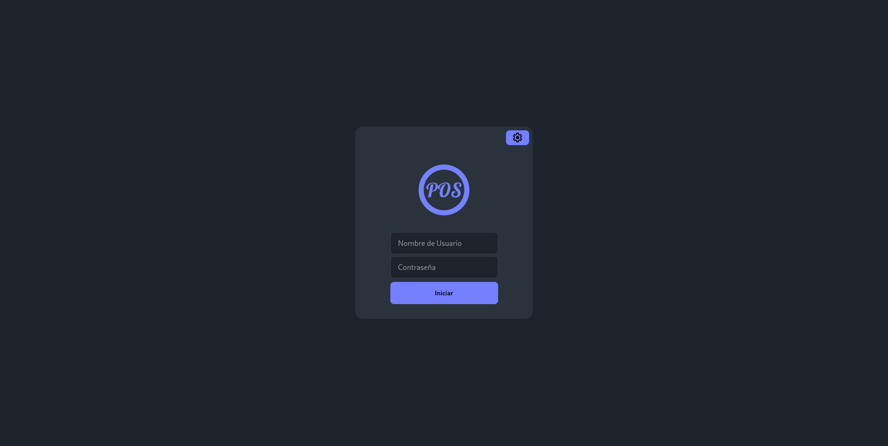

# TOTAL POS

Punto de venta 100% gratuito y de codigo abierto.

> [!WARNING]
> Tenga en cuenta que Total POS está todavía en desarrollo activo y por lo tanto no se garantiza la plena compatibilidad con versiones anteriores antes de llegar a la v1.0.0.

## Descarga o compila tu mismo

[](https://github.com/ushieru/pos-backend/releases)
[](https://github.com/ushieru/pos-client/releases)

### WEB-UI

Si quieres usar la UI Web descarga [**ui-web.zip**](https://github.com/ushieru/pos-client/releases/download/v0.0.1-alfa/ui-web.zip) descomprimelo y guarda el contenido en una carpeta **public** al nivel del binario de **pos**.

```bash
-- pos-folder
   |- pos
   |- pos.db
   |- public
      |- index.html
      |- flutter.js
      |- [etc...]
```

## Ejecutar
Ejecuta el binario con el comando serve.

```
$ ./pos serve
```

> Si tienes la UI-Web solo hace falta entrar a http://127.0.0.1:8080/ desde tu PC.

### Conectar clientes

- Asegurate de estar en la misma red local
- Use el boton de info que esta en el login para saber a que IP y puerto conectarte desde tu otro cliente (celular/PC).
  

- Desde el cliente da click al engrane y configura el IP del server al que te quieras conectar.

### Credenciales
| User    | Password | Role    |
| ------- | -------- | ------- |
| admin   | admin    | admin   |
| waiter  | waiter   | waiter  |
| cashier | cashier  | cashier |

### Config
Puedes agregar un archivo **pos-config.yaml** a nivel del ejecutable para configurar un par de cosas.

```yaml
host:
  port: 8080
database:
  name: point-of-sale
  logger: info # [info, silent, error]
jwt:
  secret: my_super_secret_word
```

## Screenshots

### Administrador 
|                                                      |                                                      |                                                            |
| ---------------------------------------------------- | ---------------------------------------------------- | ---------------------------------------------------------- |
|  |  |  |

### Mesero 
|                                                        |                                                                              |                                                                                      |
| ------------------------------------------------------ | ---------------------------------------------------------------------------- | ------------------------------------------------------------------------------------ |
|  |  |  |
